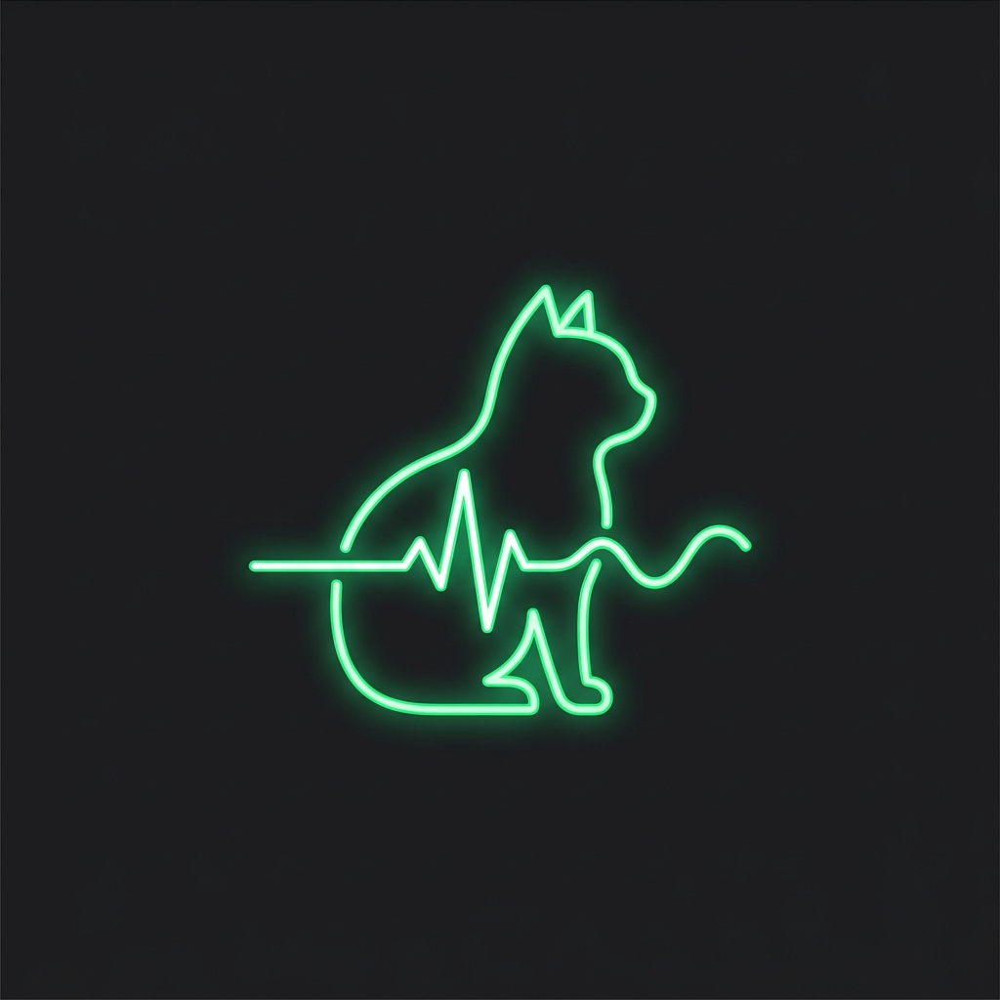
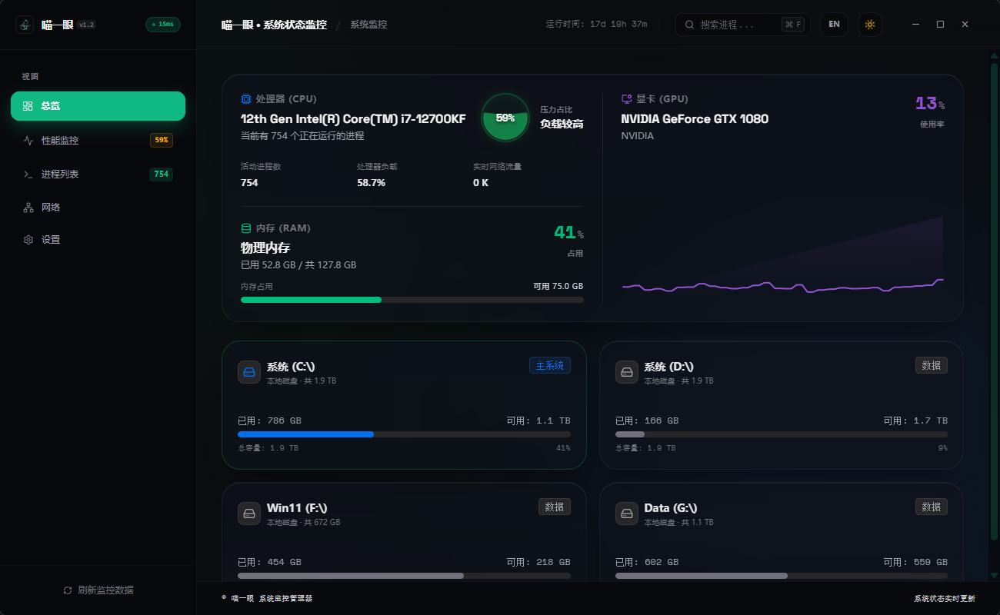
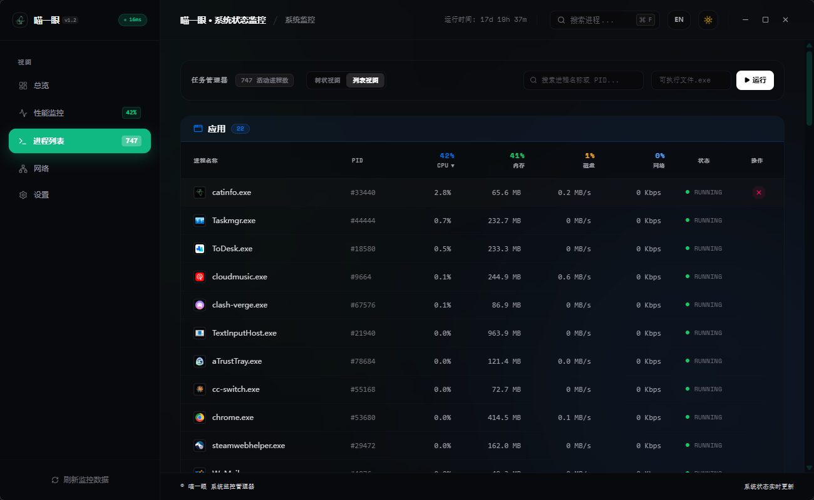
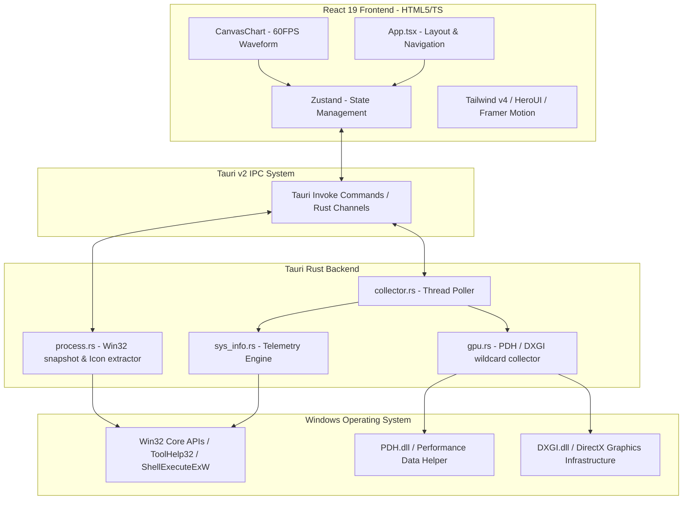

# 🐱 Cat Info (System Task Manager)

<p align="center">
  
</p>

<h3 align="center">Cat Info</h3>
<p align="center">
  A beautiful, high-performance desktop system telemetry & task manager built with <b>Tauri v2 + Rust + React 19 + TypeScript + TailwindCSS v4</b>.<br />
  一个基于 <b>Tauri v2 + Rust + React 19 + TypeScript + TailwindCSS v4</b> 构建的高颜值、极速任务管理器与性能监控应用。
</p>

<p align="center">
  <b>English</b> •
  <a href="./README_zh.md"><b>简体中文</b></a>
</p>

<p align="center">
  <a href="#-screenshots"><b>Screenshots</b></a> •
  <a href="#-core-features"><b>Core Features</b></a> •
  <a href="#-technical-architecture"><b>Architecture</b></a> •
  <a href="#-development--build"><b>Development</b></a> •
  <a href="#-deep-desktop-integration"><b>System Integration</b></a>
</p>

---

## 📸 Screenshots

### 🖥️ Dashboard Overview (Home Page)
> Aggregated summary of CPU frequency, RAM, Disks, and Network interface throughput with fluid interactive elements and micro-animations.



---

### 📈 Performance Telemetry & Per-Core Load
> High-performance Canvas charts showcasing real-time wave timelines, logical hyperthreading core arrays, and vendor-agnostic hardware GPU metrics.



---

## 🚀 Core Features

### 1. 📊 Real-Time System Telemetry
*   **Processor (CPU)**: Brand model, active clock frequency, overall utilization percentage, and a dynamic logical processor core array visualization.
*   **Memory (RAM)**: Clear tracking of used memory, available reserve, committed virtual memory, and kernel paged pools.
*   **Disk I/O**: Real-time read/write physical disk speeds, individual disk partition tracking, mounting paths, and total/available capacities.
*   **Network Bandwidth**: Active download (RX) and upload (TX) throughput rates, total session volume metrics, connection interface tracking, and active local IPv4 address resolution.

### 2. 🎮 Vendor-Agnostic GPU Telemetry Engine
*   **Low-Level DXGI & PDH**: Leverages native **DirectX Graphics Infrastructure (DXGI)** and **Performance Data Helper (PDH)** API bindings to capture system-wide graphics card statistics without vendor-specific SDK bloat.
*   **Hardware Deduplication**: Correlates GPU adapters using PCI identity keys (Vendor ID, Device ID, Revision) and LUID mappings, correctly deduplicating drivers' "phantom adapters" to fetch actual dedicated VRAM and engine loads.
*   **Universal Compatibility**: Works out of the box with **NVIDIA**, **AMD**, **Intel**, and virtual/integrated **Microsoft** display adapters.

### 3. 🛡️ Native Win32 Process Commander
*   **App vs. Background Separation**: Employs native `EnumWindows` and `IsWindowVisible` algorithms to distinguish active desktop "Apps" (owning a visible top-level window) from headless system and background processes.
*   **Dynamic Executable Icon Fetching**: Rust backend parses executables directly, extracts associated system icons via `SHGetFileInfoW`, renders them onto a custom memory device context (`CreateCompatibleDC` / `DrawIconEx`), and streams them to the frontend as Base64 BMP format.
*   **3-Tier Force Termination**:
    1.  **SIGTERM (Regular)**: Standard process handle closing.
    2.  **SIGKILL (Tree)**: Traverses process trees recursively using ToolHelp32 snapshots to terminate the parent and all child/grandchild tasks simultaneously.
    3.  **Elevated UAC Admin Kill**: When encountering protected system tasks or privilege barriers, securely spawns `taskkill` via `ShellExecuteExW` under the `"runas"` verb. This triggers the native **Windows User Account Control (UAC) dialog** for authorized termination of elevated tasks.

### 4. 🎨 Premium UX & Design Aesthetics
*   **Telegram-Style Theme Transition**: Seamlessly toggle dark (Telegram dark mode) and light themes with a circular expanding mask animation centered on your cursor coordinates, powered by the browser View Transitions API.
*   **Zero-Latency Canvas Charts**: Bypasses heavy charting libraries with a custom lightweight HTML5 Canvas waveform grid renderer, keeping graph updates at a locked 60FPS with zero UI overhead.
*   **Fluid Transitions**: Built with Framer Motion for side navigation, expanding process sheets, and deep telemetry transitions.
*   **Persistent Bilingual Setup**: One-click bilingual switching (English / Simplified Chinese) persisted in local storage.

---

## ⚙️ Deep Desktop Integration

*   **Single-Instance Enforcement**: Integrated with `tauri-plugin-single-instance`. Clicking the app launcher when it is already running automatically unminimizes, shows, and focuses the existing window.
*   **Minimize-to-Tray Residence**: Intercepts standard window close requests (`prevent_close` handler) to hide the app to the Windows System Tray instead of exiting. Includes a customized system tray menu with "Show" and "Quit" options.
*   **SeDebugPrivilege Request**: Attempts to gain native `SeDebugPrivilege` during initialization, enabling administrative users to seamlessly terminate zombie processes owned by other security contexts.
*   **Autostart Integration**: Autostart capabilities built on top of Tauri native OS autostart plugins.

---

## 🛠️ Technical Architecture



---

## 🚀 Development & Build

Ensure you have Node.js (v18+), Rust/Cargo toolchains, and Windows Build Tools (C++ workloads) configured.

### 📦 1. Clone & Install Dependencies
We recommend using the hyper-fast package manager `pnpm`:
```bash
# Install dependencies
pnpm install
```

### 🏃 2. Spin Up Hot-Reload Server (Development)
Launches the frontend development server and starts compilation of the Tauri Rust binary in debug mode:
```bash
# Launch development environment
pnpm tauri dev
```

### 🏗️ 3. Build Production Executables
Compiles the application, applies dead code elimination, and generates a standalone, lightweight Windows installer (`.msi` package):
```bash
# Compile and build production release
pnpm tauri build
```

---

## 📁 Repository Layout

*   `src/`: React 19 and TypeScript visual UI layers.
    *   `components/`: Holds primary tab components (`DashboardTab`, `PerformanceTab`, `ProcessTab`, `NetworkTab`, `SettingsTab`) and custom HTML5 Canvas wave graphs.
    *   `hooks/`: Performance state lifecycles and background listener registers.
    *   `stores/`: Zustand global memory store maintaining the hardware statistics feeds.
    *   `lib/`: Multilingual localization bundles and core config values.
*   `src-tauri/`: High-performance Rust bindings and native Windows integrations.
    *   `src/lib.rs`: Commands registration, tray event handlers, and startup routines.
    *   `src/collector.rs`: High-precision timer thread dispatching sysinfo feeds.
    *   `src/sys_info.rs`: Aggregates processor, memory, and disk statistics.
    *   `src/gpu.rs`: PDH performance counters query loop and DXGI adapters de-duplicator.
    *   `src/process.rs`: Win32 snapshot queries, ShellExecuteExW elevater, and base64 bitmap encoder.
    *   `tauri.conf.json`: Tauri configuration manifest including system capabilities and window setups.

---

## 🤝 Acknowledgements

Inspired by minimalist geometric task managers. This project aims to bring extreme telemetry visuals to your desktop with negligible runtime footprint.

*   **Tauri Framework** - For their lightweight, secure, and modern Rust desktop container.
*   **Sysinfo Crate** - Offering simple, cross-platform base telemetry models.
*   **HeroUI & TailwindCSS** - The high-contrast, modern UI foundation.
*   **Framer Motion** - Delivering fluid transition physics.

---
<p align="center">Made with ❤️ by the Cat Info Team</p>
