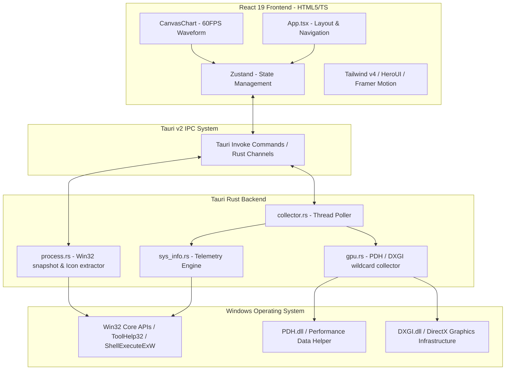

# 🐱 喵一眼 · Cat Info (系统任务管理器)

<p align="center">
  
</p>

<h3 align="center">喵一眼 (Cat Info)</h3>
<p align="center">
  一个基于 <b>Tauri v2 + Rust + React 19 + TypeScript + TailwindCSS v4</b> 构建的高颜值、极速任务管理器与性能监控应用。<br />
  A beautiful, high-performance system telemetry & task manager powered by <b>Tauri v2 + Rust + React 19 + TS + TailwindCSS v4</b>.
</p>

<p align="center">
  <a href="./README.md"><b>English</b></a> •
  <b>简体中文</b>
</p>

<p align="center">
  <a href="#-界面预览"><b>界面预览</b></a> •
  <a href="#-核心特性"><b>核心特性</b></a> •
  <a href="#-技术架构"><b>技术架构</b></a> •
  <a href="#-开发与构建"><b>开发与构建</b></a> •
  <a href="#-深度系统集成"><b>深度集成</b></a>
</p>

---

## 📸 界面预览

### 🖥️ 仪表盘总览 (Dashboard)
> 聚合展示 CPU 核心速率、内存占比、磁盘吞吐以及网速，并结合多维动态微动效。


---

### 📈 性能监控与多核负载 (Performance)
> 极高性能 Canvas 实时波形图，支持单核 / 多核超线程调度百分比监控与多 GPU 显卡（PDH / DXGI）硬件级独立显存度量。


---

## 🚀 核心特性

### 1. 📊 实时系统级监控 (System Telemetry)
*   **处理器 (CPU) 监控**：显示 CPU 品牌、当前运行主频、总体占用率以及多核多线程逻辑处理器的独立负载矩阵。
*   **内存 (RAM) 诊断**：清晰展示已用内存、可用内存、提交虚拟内存以及分页缓冲池。
*   **磁盘 I/O 吞吐**：聚合检测物理硬盘的每秒实时读取与写入速度，并列出各分区盘符、可用容量与总大小。
*   **网络带宽监控**：展示网卡上传/下载瞬时速率、总发送与接收流量，自动判定网络接口和 IPv4 地址。

### 2. 🎮 独创多 GPU 硬件级提取 (Vendor-Agnostic GPU Monitor)
*   **高性能底层对接**：绕过单一厂商 API 的局限，利用 **DXGI** 物理适配器枚举与 **PDH (Performance Data Helper)** 性能计数器。
*   **硬件去重与识别**：通过 PCI 标识（VendorId/DeviceId/Revision）与 LUID 绑定，解决显卡驱动的多幻影设备（Phantom Adapters）去重。
*   **全品牌支持**：完美支持 **NVIDIA**、**AMD**、**Intel** 独立显卡及 **Microsoft** 虚拟/集成显卡，输出实时利用率百分比与专用显存（Dedicated VRAM）占用。

### 3. 🛡️ 深度 Win32 原生进程管理器 (Process Commander)
*   **应用与后台进程智能分离**：利用原生 Win32 `EnumWindows` 与 `IsWindowVisible` 算法，精准区分“有主窗口的活动应用（Apps）”与“后台系统常驻进程”。
*   **实时图标提取**：基于 Rust 后端，直接读取 Win32 可执行文件（`.exe`）的系统关联小图标，在内存中利用 `CreateCompatibleDC` / `DrawIconEx` 绘图上下文渲染，并转码为 Base64 BMP 格式，优雅展示进程原生图标！
*   **三级强力进程阻断**：
    1.  **常规结束 (SIGTERM)**：标准句柄关闭。
    2.  **强制结束进程树 (SIGKILL / Tree)**：递归检索 ToolHelp32 进程快照，一次性销毁所有关联的子进程与孙子进程。
    3.  **管理员提权结束 (Elevated UAC Admin Kill)**：当遇到系统保护或高权限阻碍时，底层通过 `ShellExecuteExW` 唤起 Windows 系统的 `runas` 提权命令，触发 **UAC（用户账户控制）弹窗**，以系统管理员权限调度 `taskkill` 安全强杀！

### 4. 🎨 极致的现代美学交互 (Premium UX Design)
*   **Telegram 环形扩散主题切换**：支持极黑（Telegram 暗夜黑）与明亮双色主题，利用现代浏览器 `document.startViewTransition` 引擎，实现以鼠标点击处为中心的优雅圆环裁剪动画。
*   **极速 Canvas 绘图**：自研轻量级 Canvas 折线与网格实时渲染组件，代替笨重庞大的第三方图表库，实现 60FPS 零延迟渲染。
*   **流畅动效**：完全基于 Framer Motion 实现侧边栏切换、进程列表展开、进程详情展示的丝滑过渡。
*   **即时无感双语 (Bilingual)**：中文 / 英文全界面一键秒切，选项记忆持久化存储。

---

## ⚙️ 深度系统集成

*   **单实例锁 (Single-Instance)**：集成了 `tauri-plugin-single-instance`。当应用已经运行时，再次启动会强制唤醒并聚焦于已存在的窗口，防止重复拉起进程。
*   **系统托盘与常驻 (System Tray)**：完全重构了窗口 Close 行为。点击关闭按钮或按下 `X` 会执行 `prevent_close`，将主窗口隐藏至系统托盘，并在托盘菜单中提供“显示主界面 (Show)”与“彻底退出 (Quit)”选项，让监控在后台静默运行。
*   **SeDebugPrivilege 提权**：在 setup 初始化阶段，主程序会尝试申请 Windows 内核的 `SeDebugPrivilege`（调试特权），允许程序在管理员权限运行时，无阻碍地终止其他非特权用户的僵尸进程。
*   **开机自启动 (Auto-Start)**：集成 Tauri 官方 Autostart 插件，可配置开机自启。

---

## 🛠️ 技术架构



---

## 🚀 开发与构建

在开始之前，请确保您的计算机上已安装了 Rust 工具链、Node.js 运行时环境，并且已经安装了 Windows 开发工具包（对于 Windows 系统）。

### 📦 1. 克隆并安装依赖
推荐使用高效率的包管理器 `pnpm`：
```bash
# 安装依赖
pnpm install
```

### 🏃 2. 启动开发模式 (Hot Reload)
启动前端 Vite 调试服务器以及 Tauri 底层 Rust 绑定，支持代码热重载与实时编译调试：
```bash
# 启动 Tauri 开发环境
pnpm tauri dev
```

### 🏗️ 3. 构建生产包 (Production Release)
编译出经过高度混淆、体积瘦身与防逆向的安全安装包（Windows 下生成轻量级 `.msi` 安装包）：
```bash
# 构建发布版本
pnpm tauri build
```

---

## 📁 目录结构说明

*   `src/`: React 19 + TypeScript 前端视图与交互层。
    *   `components/`: 各主视图选项卡组件（`DashboardTab`、`PerformanceTab`、`ProcessTab`、`NetworkTab`、`SettingsTab`）与 Canvas 实时波形渲染器。
    *   `hooks/`: 状态生命周期管理钩子。
    *   `stores/`: Zustand 共享内存池，存储实时采集的硬件和进程快照。
    *   `lib/`: 多国语言翻译包映射表及基础通用配置。
*   `src-tauri/`: Rust 原生硬件交互与 Windows 操作系统集成层。
    *   `src/lib.rs`: 注册原生 Tauri 核心指令、系统托盘绑定与初始化配置。
    *   `src/collector.rs`: 定时器双工循环线程，负责调度 SysInfo / GPU 采集并双向广播。
    *   `src/sys_info.rs`: 系统软硬件指标收集器（Sysinfo Crate 与原生 Windows 组合封装）。
    *   `src/gpu.rs`: 高级 PDH 计数器阵列与 DXGI 双显卡硬件提取引擎。
    *   `src/process.rs`: Windows 原生进程句柄检索、提权强杀与 Base64 进程图标像素流转码工具。
    *   `tauri.conf.json`: Tauri 包标识符、系统权限许可清单及窗口规格定制。

---

## 🤝 贡献与感谢

该项目的设计灵感源自现代极简与极客美学，致力于以极小的系统开销提供比任务管理器更轻快、更赏心悦目的实时监控体验。

*   **Tauri Framework** - 提供轻量、安全的原生 Rust 桌面容器支持。
*   **Sysinfo Crate** - 提供了跨平台的基础系统硬件采集接口。
*   **HeroUI & TailwindCSS** - 实现了现代化、超高对比度且视觉舒适的界面质感。
*   **Framer Motion** - 提供了丝滑柔顺的排版与选项卡过渡物理缓动。

---
<p align="center">Made with ❤️ by the Cat Info Team</p>
